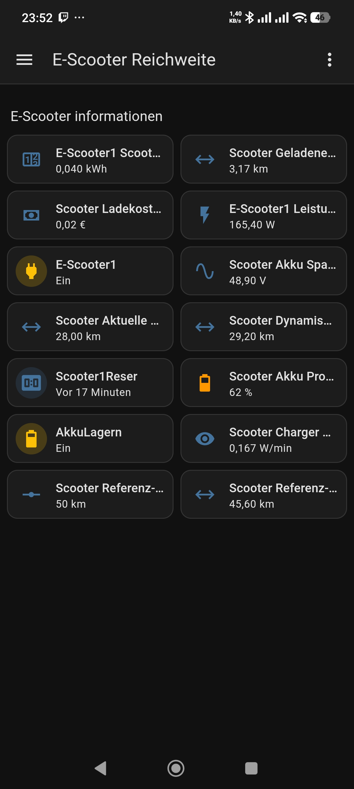

# Home-Assistent-epf2-pro-Ikea-Steckdose
Zeigt den aktuellen Akkustand und Kilometer an anhand einer Stromzähler Steckdose von Ikea für 8€

es muss noch ein knopf erstellt werden um den Energie Zähler zurück zu setzen und ein Helfer für einen Energiezähler für den E-Scooter

